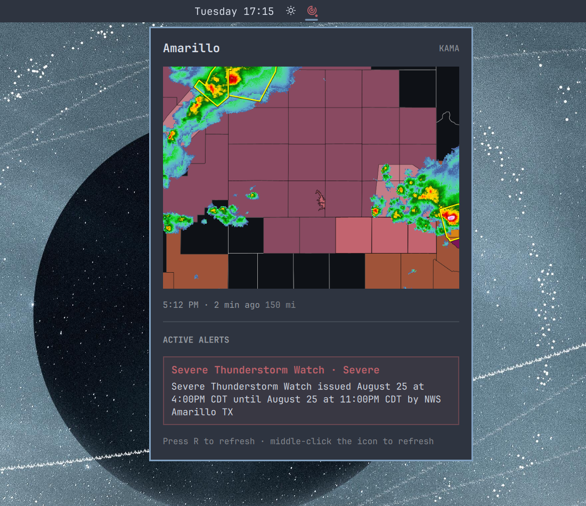

<div align="center">

# NWS Radar

**Live NWS (US) radar imagery and severe weather alerts, right in your [Omarchy](https://omarchy.org/) bar.**

[](LICENSE)
[](https://omarchy.org/)

</div>



Click the bar icon and get a radar map centered on your home, refreshed
straight from the National Weather Service — no API key required. When
severe weather is issued for your area, the icon turns red and a desktop
notification lets you know before you even open the panel.

## Features

- **Bar icon that only speaks up when it matters.** It sits quietly until a
  watch, warning, or advisory is active for your location, then turns red
  with a small alert dot.
- **A real radar map, not a screenshot.** The panel shows a live composite
  of base reflectivity, counties, and watch/warning overlays — the same
  data that powers `radar.weather.gov` — refreshed roughly every 2 minutes.
- **Desktop notifications** for new alerts at or above a severity you
  choose (Extreme, Severe, Moderate, Minor), so you don't have to keep the
  panel open to stay informed. All active alerts remain visible in the panel,
  and clicking a notification opens it.
- **No API key, no account, no sign-up.** Everything comes from
  `api.weather.gov` and NWS's public map server, both free and keyless. The
  plugin identifies itself to NWS automatically; no personal contact details
  or extra setup are required.
- Matches your Omarchy theme, with the radar map itself kept on a fixed
  dark background so the county lines and reflectivity colors stay legible
  no matter which theme you're running.

## Install

### Requirements

- An Omarchy release with shell plugin support (tested with Omarchy 4.0.1).
- `curl`, which is included with Omarchy.
- An explicit or automatically detected location in Omarchy's built-in
  Weather widget.
- Network access to `api.weather.gov`, `opengeo.ncep.noaa.gov`, and `wttr.in`.

NWS radar and alert coverage is focused on the United States and its
territories. Locations outside that coverage area will not produce useful
radar imagery or alerts.

```sh
omarchy plugin add https://github.com/stdasi/omarchy-nws-radar.git --enable
```

Add the bar icon later if you skip `--enable` now:

```sh
omarchy bar put stdasi.nws-radar --section center
```

## Updating

Updates aren't automatic — Omarchy never checks for or fetches new plugin
code on its own. Pull the latest version yourself with:

```sh
omarchy plugin update stdasi.nws-radar
```

(or `omarchy plugin update` with no id to update every git-managed plugin you
have installed). This shows you the diff before applying it, does a
fast-forward-only pull, and rolls back automatically if the new version fails
validation. See the official
[Omarchy shell plugins manual](https://omarchy.org/manual/shell-plugins/) for
the full details.

## Setup

**Confirm your location.** This plugin reads an explicitly saved location
from Omarchy's built-in Weather widget. If Weather is using its default
IP-based auto-detection, NWS Radar performs the same detection itself and
labels the location `(auto)`. To override it, click the location name in
Weather, search for your city, and select a suggestion. NWS Radar picks up
the saved coordinates automatically and never writes that file itself.

That's it — no accounts, tokens, or contact-information setup. The plugin
identifies itself to `api.weather.gov` with its name, version, and public
project URL, and alert polling begins automatically once a location is
available.

## Usage

- **Click** the bar icon to open the panel.
- **Middle-click** the icon, or press `r` in the panel, to force a refresh.
- The panel lists every active alert for your area below the radar map,
  newest first, color-coded by severity.

## Settings

| Setting | Default | What it does |
| --- | --- | --- |
| Minimum severity to notify | Moderate | The lowest NWS severity that triggers a desktop notification (Extreme > Severe > Moderate > Minor > Unknown). It does not hide active alerts. |
| Alert poll interval | 300s | How often the plugin checks `api.weather.gov` for new alerts. |
| Radar image refresh | 300s | How often the open panel checks for a newer radar frame. |
| Radar range | 150mi | The horizontal distance shown from the map center to either edge. |

## How the radar imagery works

<details>
<summary>A composite map straight from NWS's own map server — expand for the details</summary>

The radar map is a single request against the NWS GeoServer WMS at
`opengeo.ncep.noaa.gov` — the same public, keyless service that backs
`radar.weather.gov`. One request renders four layers server-side, bottom to
top:

| Layer | What it draws |
| --- | --- |
| County outlines | Light gray boundaries; county polygons tile up to state lines, so state borders come through for free. |
| Watches & advisories | Translucent fills, drawn *under* the radar so precipitation stays vivid on top of them. |
| Base reflectivity | NWS's quality-controlled 1&nbsp;km mosaic, a new frame roughly every 2 minutes. |
| Warnings | Outline-only, drawn on top, so a warning box never mutes the storm core it's drawn around. |

The request is made in Web Mercator (EPSG:3857) so the map isn't stretched
by latitude, and it's pinned to the exact timestamp of the newest published
frame — read from the layer's capabilities — so the "as of" label under the
map always matches the pixels exactly, and a new frame automatically busts
the image cache.

This replaced the older RIDGE II loop GIF
(`radar.weather.gov/ridge/standard/{STATION}_loop.gif`), which refreshes
only every ~5 minutes and can't be composited with alert overlays this way.

</details>

## Privacy and network access

The plugin reads your Weather widget location locally and does not modify it.
When Weather has no explicitly saved location, the plugin requests `wttr.in`'s
weather response to derive an approximate location from your public IP. Your
coordinates and the plugin's fixed public identity (name, version, and project
URL) are sent to `api.weather.gov` when resolving the nearby radar station and
checking alerts. No personal contact information is collected. Radar image
requests go to `opengeo.ncep.noaa.gov`; their map bounds reveal the approximate
center of the requested area, but the plugin's NWS User-Agent is not sent to
either `wttr.in` or the map server.

The plugin stores active-alert IDs in Omarchy's persistent plugin properties
to avoid sending the same desktop notification repeatedly. It stores no radar
imagery, account credentials, or API tokens.

## Uninstalling

```sh
omarchy plugin remove stdasi.nws-radar
```

This plugin never writes the location file. Omarchy may retain its normal
widget settings and the small notification-deduplication record described
above; no separate cache or data directory needs to be removed.

## Other notes

A few design notes for anyone digging into the code:

- Polling only runs while the icon is placed in a bar section (a single
  `bar-widget` entry point with an embedded `Service {}` poller, like
  `panels/tailscale` in Omarchy itself). Remove the icon from the bar and
  alert notifications stop until it's added back.
- The radar image only refreshes while the panel is open, so an idle icon
  in the bar costs no bandwidth.
- The station ID shown next to your location comes from
  `api.weather.gov/points` and is informational only — the radar mosaic is
  seamless across station boundaries, so the imagery itself isn't tied to
  a single station.
- An `(auto)` location is approximate and comes from the same IP-based
  `wttr.in` fallback used by the built-in Weather widget. Saving a location in
  Weather replaces it with exact shared coordinates.

## License

MIT — see [LICENSE](LICENSE).

Issues and contributions are welcome through the GitHub repository.
